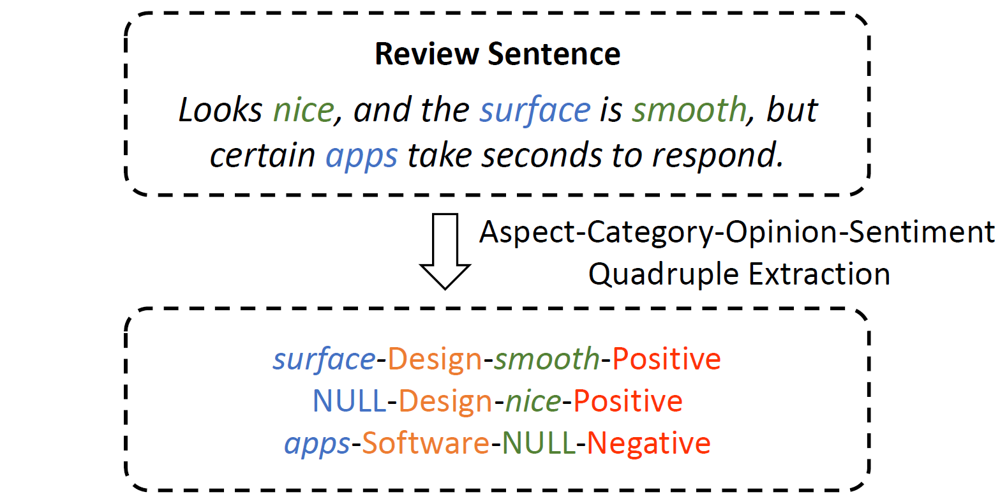
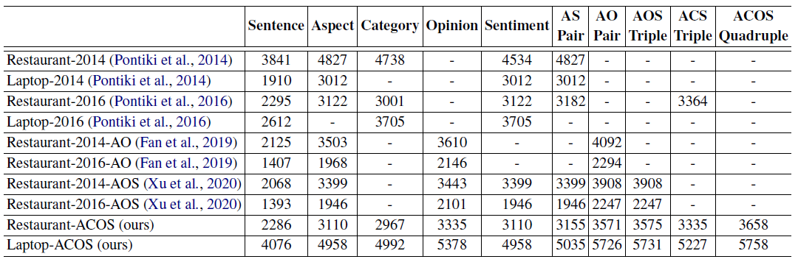
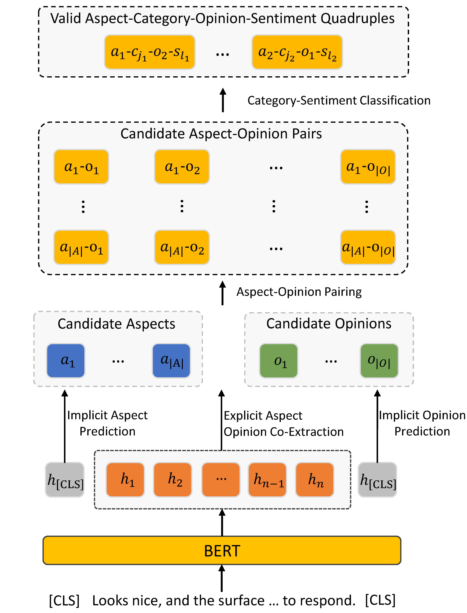
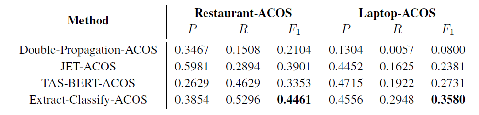
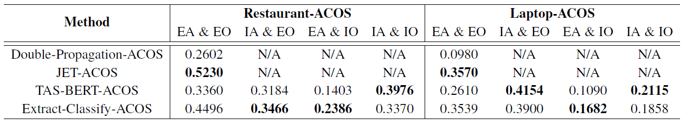

<!-- # ACOS

We are making the final preparations for the release of our data and code. They will be coming soon. -->

# Aspect-Category-Opinion-Sentiment (ACOS) Quadruple Extraction

This repo contains the data sets and source code of our paper: 

Aspect-Category-Opinion-Sentiment Quadruple Extraction with Implicit Aspects and Opinions [[ACL 2021]](https://aclanthology.org/2021.acl-long.29.pdf).
- We introduce a new ABSA task, named Aspect-Category-Opinion-Sentiment Quadruple (ACOS) Extraction, to extract fine-grained ABSA Quadruples from product reviews;
- We construct two new datasets for the task, with ACOS quadruple annotations, and benchmark the task with four baseline systems;
- Our task and datasets provide a good support for discovering implicit opinion targets and implicit opinion expressions in product reviews.


## Task
The Aspect-Category-Opinion-Sentiment (ACOS) Quadruple Extraction aims to extract all aspect-category-opinion-sentiment quadruples, i.e., (aspect expression, aspect category, opinion expression, sentiment polarity), in a review sentence including implicit aspect and implicit opinion.

<p align="center">

</p>

<!--  -->

## Datasets
Two new datasets, Restaurant-ACOS and Laptop-ACOS, are constructed for the ACOS Quadruple Extraction task:
- Restaurant-ACOS is an extension of the existing SemEval Restaurant dataset, based on which we add the annotation of implicit aspects, implicit opinions, and the quadruples;
- Laptop-ACOS is a brand new one collected from the Amazon Laptop domain. It has twice size of the SemEval Loptop dataset, and is annotated with quadruples containing all explicit/implicit aspects and opinions.

The following table shows the comparison between our two ACOS Quadruple datasets and existing representative ABSA datasets.

<p align="center">

</p>
<!--  -->

## Methods
We benchmark the ACOS Quadruple Extraction task with four baseline systems: 
- Double-Propagation-ACOS
- JET-ACOS
- TAS-BERT-ACOS
- Extract-Classify-ACOS

We provided the source code of Extract-Classify-ACOS. The source code of the other three methods will be provided soon.

Overview of our Extract-Classify-ACOS method. The first step performs aspect-opinion co-extraction, and the second step predicts category-sentiment given the aspect-opinion pairs.

<p align="center">
  
</p>
<!--  -->

## Results
The ACOS quadruple extraction performance of four different systems on the two datasets:

<p align="center">
  
</p>

We further investigate the ability of different systems in addressing the implicit aspects/opinion problem:

<p align="center">
  
</p>

## Citation
If you use the data and code in your research, please cite our paper as follows:
```
@inproceedings{cai2021aspect,
  title={Aspect-Category-Opinion-Sentiment Quadruple Extraction with Implicit Aspects and Opinions},
  author={Cai, Hongjie and Xia, Rui and Yu, Jianfei},
  booktitle={Proceedings of the 59th Annual Meeting of the Association for Computational Linguistics and the 11th International Joint Conference on Natural Language Processing (Volume 1: Long Papers)},
  pages={340--350},
  year={2021}
}
```
